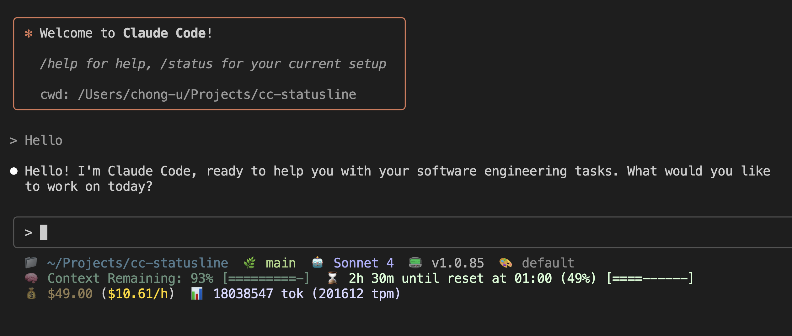
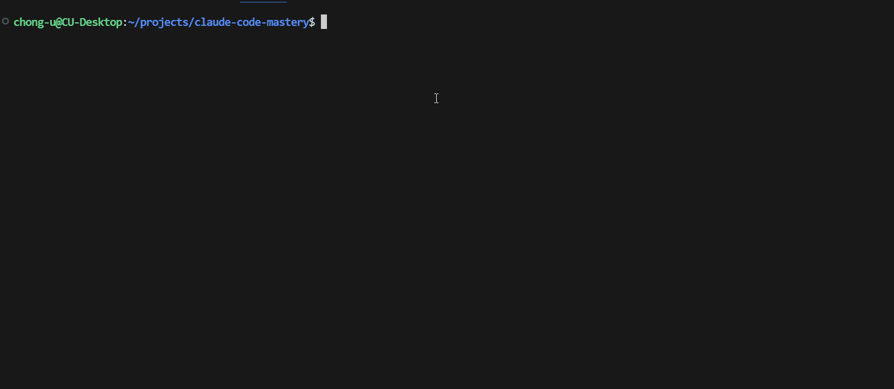

# cc-statusline

<div align="center">

**A beautiful, informative statusline for Claude Code**



*Real-time directory, git branch, model info, costs, and session time tracking*

[](https://www.npmjs.com/package/@chongdashu/cc-statusline)
[](https://opensource.org/licenses/MIT)
[](https://nodejs.org/)

</div>

## ⚠️ IMPORTANT: Install jq First!

> **Without jq, your statusline will have LIMITED functionality:**
> - ❌ No context remaining percentage
> - ❌ No token statistics from ccusage
> - ❌ Slower performance
> - ❌ Less reliable JSON parsing

### Install jq (takes 30 seconds):

#### macOS
```bash
brew install jq
```

#### Linux
```bash
# Ubuntu/Debian
sudo apt-get install jq

# CentOS/RHEL
sudo yum install jq
```

#### Windows 10/11 Users

**Option 1: Package Manager (Easiest)**
```bash
# If you have Chocolatey
choco install jq

# If you have Scoop
scoop install jq
```

**Option 2: Manual Download (No admin required)**
1. Go to https://github.com/jqlang/jq/releases/latest
2. Download the right file for your system:
   - **64-bit Windows** (most common): Download `jq-windows-amd64.exe`
   - **32-bit Windows** (older systems): Download `jq-windows-i386.exe`
3. Rename the downloaded file to just `jq.exe`
4. Move `jq.exe` to one of these locations:
   - `C:\Windows\System32\` (requires admin) - works everywhere
   - Or create `C:\tools\` and add it to your PATH
5. **Add to PATH** (if not in System32):
   - Press `Win + X`, select "System"
   - Click "Advanced system settings"
   - Click "Environment Variables"
   - Under "User variables", select "Path" and click "Edit"
   - Click "New" and add `C:\tools\` (or wherever you put jq.exe)
   - Click OK on all windows
6. **Test it**: Open a new Command Prompt or PowerShell and type `jq --version`

📦 **Direct downloads:** https://github.com/jqlang/jq/releases

---

## ⚡ Quick Start

**After installing jq, one command. Three questions. Custom statusline.**

```bash
npx @chongdashu/cc-statusline@latest init
```

That's it! Answer a few simple questions, restart Claude Code, and enjoy your new statusline.

### 📋 Prerequisites
- **Node.js 16+** (required)
- **jq** (STRONGLY recommended) - Required for context tracking, token stats, and reliable performance

### 🆕 Installation Options (v1.2.4+)
- **🏠 Global Installation** (`~/.claude/`) - Use across all your projects
- **📂 Project Installation** (`./.claude/`) - Keep settings project-specific

### 📈 What's New in v1.3.0
- **🔥 Improved Burn Rate** - Now calculates $/hour directly from Claude Code data (no ccusage dependency)
- **📁 Smart Logging** - Logs are created relative to statusline installation location
- **✨ Version Headers** - Generated statuslines now include the cc-statusline version

## 🎯 Simple Setup



## ✨ What You Get

⚠️ **Note: Most features require jq to be installed!**

Enhance your Claude Code terminal with useful information:

- **📁 Directory Display** - Current folder with `~` abbreviation
- **🌿 Git Integration** - Current branch name  
- **🤖 Model Info** - Shows which Claude model you're using plus Claude Code version
- **🧠 Context Usage** - Real-time context window usage with progress bars **(requires jq)**
- **💰 Cost Tracking** - Live cost monitoring with burn rates via ccusage **(partial without jq)**
- **⌛ Session Timer** - Time remaining until usage limit resets **(requires jq)**
- **📊 Token Analytics** - Token consumption and burn rate metrics **(requires jq)**
- **🎨 Color Support** - 256-color palette for Claude Code terminals
- **⚡ Fast Execution** - Optimized bash script with <100ms execution time

## 🎛️ Features Overview

### 🔥 Default Features (All Pre-selected in v1.2.2+)
| Feature | Description | Example |
|---------|-------------|---------|
| 📁 **Directory** | Current working directory | `~/my-project` |
| 🌿 **Git Branch** | Active git branch | `feature/statusline` |
| 🤖 **Model** | Claude model name & version | `Sonnet 4` |
| 📟 **Claude Code** | Claude Code version | `v1.0.85` |
| 🎨 **Output Style** | Current output style setting | `default` |
| 🧠 **Context** | Remaining context with progress bar | `83% [========--]` |
| 💰 **Cost** | Live costs with highlighted burn rate | `$49.00 ($16.55/h)` |
| ⌛ **Session** | Time until reset with progress | `3h 7m until reset at 01:00 (37%) [===-------]` |

### 🚀 Power Features (Also Pre-selected)
| Feature | Description | Example |
|---------|-------------|---------|
| 📊 **Tokens** | Token consumption with burn rate | `14638846 tok (279900 tpm)` |

### 🎨 Example Outputs

**New 3-Line Modern Layout (v1.2.2+):**
```
📁 ~/Projects/cc-statusline  🌿 feature/context-usage-output-styles  🤖 Sonnet 4  📟 v1.0.85  🎨 default
🧠 Context Remaining: 83% [========--]  ⌛ 3h 7m until reset at 01:00 (37%) [===-------]
💰 $49.00 ($16.55/h)  📊 14638846 tok (279900 tpm)
```

**Compact Mode:**
```
📁 ~/my-app  🌿 main  🤖 Claude Sonnet  📟 v1.0.85
🧠 Context Remaining: 95% [=========-]
💰 $2.48 ($12.50/h)
```

## 🛠️ Advanced Usage

### Preview Your Statusline
Test your statusline before restarting Claude Code:

```bash
cc-statusline preview .claude/statusline.sh
```

**What preview does:**
1. 📄 **Loads** your actual statusline script
2. 🧪 **Runs** it with realistic mock data  
3. 📊 **Shows** exactly what the output will look like
4. ⚡ **Reports** performance metrics and functionality

### Installation Safety Features (v1.2.4+)
- 🔒 **Safe Updates** - Never overwrites existing statuslines without confirmation
- 🛡️ **Settings Protection** - Preserves your existing settings.json configurations
- ⚠️ **Conflict Detection** - Warns when other statuslines are configured
- ✅ **Smart Defaults** - Project-level installation by default for safety

### Custom Installation
```bash
# Generate to custom location
cc-statusline init --output ./my-statusline.sh

# Skip auto-installation (manual setup)
cc-statusline init --no-install

# Global installation for convenience
npm install -g @chongdashu/cc-statusline
```

## 🔧 How It Works

### How It Works

1. **🎯 Configuration** - Two questions configure your preferences
2. **🏗️ Generation** - Creates optimized bash script tailored to your needs  
3. **⚙️ Installation** - Integrates with Claude Code settings
4. **🔄 Updates** - Connects to ccusage for live usage statistics

### Technical Architecture

- **⚡ Bash-First** - Native shell execution for maximum speed
- **🎨 Claude Code Optimized** - Forces colors for Claude Code terminals (respects NO_COLOR)
- **🌍 Environment Respect** - Honors `NO_COLOR` and other terminal conventions
- **📦 Zero Dependencies** - Self-contained script with graceful fallbacks
- **🔒 Secure** - No network requests except ccusage integration

## 📋 Requirements

### ✅ Required (You Already Have These!)
- **Claude Code** - The tool you're already using
- **jq** - JSON processing (pre-installed on most systems)

### 🎁 Optional Enhancements
- **git** - For branch display (you probably have this)
- **ccusage** - For usage stats (works via `npx` - no install needed)

### Quick Compatibility Check
```bash
command -v jq && echo "✅ Ready to go!"
```

## 📂 File Structure

After installation, you'll have a clean setup:

```
.claude/
├── statusline.sh    # 🎯 Your generated statusline script
└── settings.json    # ⚙️ Auto-updated Claude Code configuration
```

### Manual Configuration (Backup Plan)

If auto-configuration fails, simply add this to `.claude/settings.json`:

```json
{
  "statusLine": {
    "type": "command",
    "command": ".claude/statusline.sh",
    "padding": 0
  }
}
```

## 🔧 Troubleshooting

### 🚫 Statusline Not Showing
1. **Restart Claude Code** after installation
2. **Verify settings** - Check `.claude/settings.json` contains the configuration above
3. **Check permissions** - Ensure script is executable: `chmod +x .claude/statusline.sh`

### 🐌 Performance Issues
- **Test performance**: `cc-statusline preview .claude/statusline.sh`
- **Optimize features**: Disable heavy features if execution > 500ms
- **Disable ccusage**: Remove usage tracking if not needed

### 🧩 Missing Features
- **Install jq**: `brew install jq` (macOS) or `apt install jq` (Ubuntu)
- **ccusage setup**: Works automatically via `npx ccusage@latest`
- **Git not found**: Install git for branch display
- **Context not showing**: Ensure you're in an active Claude Code session with context usage
- **Colors not working**: Check that NO_COLOR environment variable is not set

## 🚀 Performance

| Metric | Target | Typical |
|--------|--------|---------|
| **Execution Time** | <100ms | 45-80ms |
| **Memory Usage** | <5MB | ~2MB |
| **CPU Impact** | Negligible | <1% |
| **Dependencies** | Minimal | jq only |

*Benchmarked on macOS with all features enabled*

## 🤝 Contributing

Contributions are welcome!

**Quick Start:**
```bash
git clone https://github.com/chongdashu/cc-statusline
cd cc-statusline
npm install && npm run build
```

**Contribution Areas:**
- 🐛 **Bug Fixes** - Help make it more robust
- ✨ **New Features** - Add support for more runtimes/features  
- 📚 **Documentation** - Improve guides and examples
- 🧪 **Testing** - Add test coverage and edge cases

See our [Contributing Guide](CONTRIBUTING.md) for detailed information.

## 🧪 Testing

### Locking Mechanism Tests

The ccusage integration includes a robust file-based locking mechanism to prevent concurrent process spawning. Test this functionality:

**Single Test:**
```bash
echo '{}' | ./test/test-statusline-with-lock.sh
```

**Concurrent Test:**
```bash
./test/test-concurrent-locking.sh
```

**Manual Concurrent Test:**
```bash
# Spawn 10 concurrent processes
for i in {1..10}; do 
  echo '{}' | ./test/test-statusline-with-lock.sh & 
done
```

**Expected Behavior:**
- ✅ Only 1 process runs ccusage at a time
- ✅ Other processes skip gracefully (no pile-up)
- ✅ Lock files are properly cleaned up
- ✅ No hanging processes remain

**Verification Commands:**
```bash
# Check for stale locks
ls /tmp/ccusage_statusline.* 2>/dev/null || echo "✅ No locks remain"

# Monitor running processes
ps aux | grep ccusage | grep -v grep
```

## 📊 Stats

<div align="center">


</div>

## 🔗 Related Projects

- **[ccusage](https://github.com/ryoppippi/ccusage)** - Claude Code usage analytics (would not be possible with it!)
- **[Claude Code](https://docs.anthropic.com/en/docs/claude-code)** - Official documentation

## 👥 Contributors

We're grateful for all contributions that make cc-statusline better! 

- **[Jonathan Borgwing (@DevVig)](https://github.com/DevVig)** - Critical performance fix for infinite ccusage process spawning ([#4](https://github.com/chongdashu/cc-statusline/pull/4))

### How to Contribute

Want to see your name here? Check out our [Contributing Guide](CONTRIBUTING.md) and help make cc-statusline even better!

We welcome:
- 🐛 Bug fixes and performance improvements
- ✨ New features and enhancements  
- 📚 Documentation improvements
- 🧪 Test coverage and quality assurance

## 📝 Changelog

See [CHANGELOG.md](CHANGELOG.md) for detailed release history.

## 📄 License

MIT License - see [LICENSE](LICENSE) file for details.

---

<div align="center">

**Made by [Chong-U](https://github.com/chongdashu) @ [AIOriented](https://aioriented.dev)**

</div>